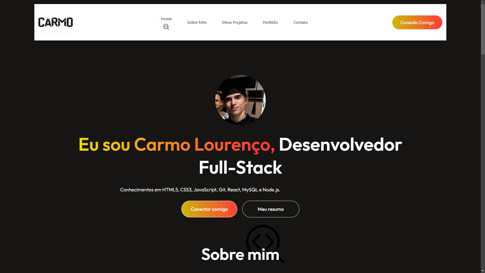

# Portfólio - Carmo

Este é meu portfólio desenvolvido com React, onde apresento meus projetos, habilidades e formas de contato.
O objetivo é centralizar minhas experiências como desenvolvedor e facilitar o acesso ao meu trabalho.

---

## Tecnologias utilizadas

* React
* JavaScript
* HTML5
* CSS3

---

## Preview



---

## Acesse o projeto

https://carmo22b.github.io/Portf-lio/

---

## Como rodar o projeto

Clone o repositório:

```bash
git clone https://github.com/Carmo22b/Portf-lio.git
```

Acesse a pasta do projeto:

```bash
cd Portf-lio
```

Instale as dependências:

```bash
npm install
```

Inicie o projeto:

```bash
npm start
```

---

## Sobre mim

Sou desenvolvedor, com foco em desenvolvimento web utilizando tecnologias como React, Node.js e CakePHP.
Atualmente estou em busca de uma oportunidade na área de desenvolvimento para aplicar e evoluir meus conhecimentos.

---

## Melhorias futuras

* Melhorar responsividade
* Adicionar animações
* Integrar com backend
* Melhorar UI/UX

---

## Contato

* GitHub: https://github.com/Carmo22b
* Portfólio: https://carmo22b.github.io/Portf-lio/

---
